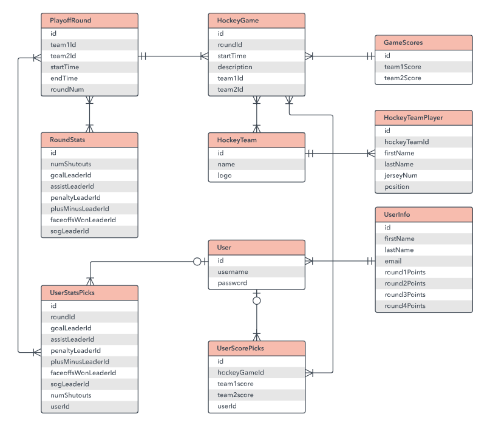

# Lý thuyết cơ bản về thiết kế cơ sở dữ liệu.

## Lợi ích thiết kế database theo đúng chuẩn và quy tắc

- Tối ưu hiệu suất: Nhờ cấu trúc hợp lý, các truy vấn sẽ được thực hiện nhanh chóng hơn, cải thiện khả năng phản hồi của hệ thống ngay cả khi có nhiều yêu cầu đồng thời.

- Dễ bảo trì và phát triển: Cấu trúc logic, rõ ràng cho phép database linh hoạt mở rộng khi dữ liệu và số lượng người dùng tăng lên mà không cần chỉnh sửa toàn bộ hệ thống.

- Đảm bảo tính toàn vẹn và chính xác của dữ liệu: Thiết kế cơ sở dữ liệu theo chuẩn sẽ loại bỏ dữ liệu dư thừa và tránh lưu trữ thông tin trùng lặp. Nhờ đó, dữ liệu luôn nhất quán, chính xác và đáng tin cậy.

- Khả năng mở rộng tốt: Cơ sở dữ liệu được xây dựng chuẩn ngay từ đầu sẽ giúp hệ thống mở rộng linh hoạt, đáp ứng hiệu quả sự gia tăng về dữ liệu và người dùng theo thời gian.. Dù lượng dữ liệu, người dùng hay số lượng giao dịch tăng lên, hệ thống vẫn hoạt động ổn định mà không bị giảm hiệu năng.

- Tăng cường bảo mật: Cách thiết kế database bài bản sẽ tích hợp các cơ chế bảo mật ngay ở cấp độ cấu trúc. Nhờ đó, dữ liệu được bảo vệ khỏi truy cập trái phép và các mối đe dọa, đảm bảo chỉ người có thẩm quyền mới được phép xem hoặc chỉnh sửa thông tin.

## Các tiêu chí đánh giá 1 thiết kế database tốt

- Tính chính xác và toàn vẹn của dữ liệu: Cơ sở dữ liệu phải đảm bảo lưu trữ dữ liệu một cách nhất quán, không dư thừa. Dữ liệu được duy trì chính xác, tránh các lỗi do thông tin trùng lặp hoặc xung đột, đảm bảo độ tin cậy cho dữ liệu doanh nghiệp.

- Khả năng mở rộng: Thiết kế cần cho phép mở rộng dễ dàng khi dữ liệu và lưu lượng truy cập tăng. Cơ sở dữ liệu nên hỗ trợ việc thêm dữ liệu, người dùng hoặc giao dịch mà không làm giảm hiệu suất xử lý. Kiến trúc linh hoạt, có tính module hóa sẽ giúp hệ thống scale up hoặc scale out khi cần thiết.

- Hiệu suất truy vấn cao: Cấu trúc bảng, chỉ mục (index) và khóa ngoại được xây dựng hợp lý giúp truy vấn chạy nhanh, rút ngắn thời gian phản hồi của ứng dụng.

- Tính bảo mật: Cơ sở dữ liệu cần được thiết kế với các tính năng bảo mật tích hợp. Ví dụ: phân quyền người dùng rõ ràng, áp dụng mã hóa cho dữ liệu nhạy cảm, có cơ chế sao lưu và phục hồi.

- Dễ bảo trì: Tiêu chí này đánh giá mức độ dễ dàng khi sửa đổi hoặc nâng cấp cấu trúc dữ liệu. Cơ sở dữ liệu dễ bảo trì thường có các bảng, trường đặt tên và tổ chức hợp lý, hạn chế sự phức tạp không cần thiết.

- Khả năng tích hợp: Một cơ sở dữ liệu tốt cần dễ dàng tích hợp với các hệ thống, dịch vụ khác (ví dụ: ứng dụng web, phần mềm doanh nghiệp hoặc kho dữ liệu). Thiết kế tuân thủ các chuẩn chung (chẳng hạn định dạng dữ liệu nhất quán, khóa chính/ngoại rõ ràng) sẽ giúp việc kết nối, trao đổi dữ liệu giữa các hệ thống thuận lợi và ít lỗi hơn.

- Tính linh hoạt khi thay đổi nghiệp vụ: Trong môi trường kinh doanh năng động, yêu cầu nghiệp vụ có thể thay đổi. Cấu trúc dữ liệu nên cho phép bổ sung trường mới, bảng mới hoặc điều chỉnh mối quan hệ giữa các bảng một cách dễ dàng, giúp hệ thống nhanh chóng đáp ứng nhu cầu mới.

## Cách thiết kế database

### Bước 1: Xác định yêu cầu và mục đích của CSDL

- Thu thập yêu cầu từ người dùng hoặc doanh nghiệp (dữ liệu cần lưu, quy trình nghiệp vụ).

- Xác định mục tiêu cụ thể của CSDL. Ví dụ: quản lý khách hàng, theo dõi bán hàng, phân tích báo cáo,...

- Xác định phạm vi hệ thống: Dữ liệu nào cần lưu, ai sẽ sử dụng, và quyền truy cập ra sao.

- Lập tài liệu mô tả yêu cầu (Data Requirement Document) để làm nền tảng cho các bước thiết kế tiếp theo.

Ví dụ: Ví dụ, bạn đang thiết kế cơ sở dữ liệu quản lý bán hàng cho một shop online. Hệ thống này cần lưu trữ thông tin về khách hàng, sản phẩm, đơn hàng và chi tiết đơn hàng, giúp doanh nghiệp dễ dàng theo dõi hoạt động kinh doanh, quản lý tồn kho và doanh thu

| Thực thể    | Thuộc tính chính                       | Mối quan hệ                              |
| ----------- | -------------------------------------- | ---------------------------------------- |
| Customer    | CustomerID, Name, Email, Phone         | 1 khách hàng có nhiều đơn hàng           |
| Product     | ProductID, Name, Price, StockQuantity  | Một sản phẩm có thể thuộc nhiều đơn hàng |
| Order       | OrderID, OrderDate, CustomerID         | Thuộc về 1 khách hàng                    |
| OrderDetail | OrderDetailID, OrderID, ProductID, Qty | Nhiều sản phẩm trong 1 đơn hàng          |

### Bước 2: Nghiên cứu và hệ thống hóa thông tin cần lưu trữ.

Trong bước này, cần tìm kiếm và sắp xếp thông tin cần thiết, rồi xác định các thực thể (entities) và mối quan hệ (relationships) giữa chúng để dữ liệu dễ quản lý, tránh trùng lặp. Mục tiêu là tổ chức cơ sở dữ liệu có cấu trúc và hệ thống trước khi chuyển sang thiết kế logic.

Nhóm thông tin chính (theo ShopOnline):

- Product: Tên sản phẩm, mô tả, giá, tồn kho.

- Order: Ngày đặt hàng, tổng tiền, trạng thái, địa chỉ giao hàng.
- Customer: Tên, email, số điện thoại, địa chỉ.

Sơ đồ ERD (khuyến nghị sử dụng để biểu diễn trực quan):

- Thực thể & thuộc tính (ví dụ):

* Customer: CustomerID, Name, PhoneNum, Email

* Order: OrderID, OrderDate, TotalPrice, CustomerID

* Product: ProductID, Name, Price, Stock

* OrderDetail: (OrderID, ProductID), Quantity, PriceEach

- Mối quan hệ:

* Customer (1) — (N) Order (mỗi đơn thuộc về một khách hàng)

* Order (1) — (N) OrderDetail — (N) Product (1) (OrderDetail làm bảng nối N-N giữa Order và Product)

### Thiết kế dữ liệu mức logic (Logical Design)

Ở bước này, chúng ta sẽ chuyển đổi sơ đồ ERD từ bước trước thành một mô hình dữ liệu logic cụ thể và có tổ chức. Mục tiêu nhằm đảm bảo rằng toàn bộ dữ liệu trong hệ thống được sắp xếp hợp lý, dễ quản lý, và phản ánh chính xác nhu cầu thực tế của doanh nghiệp.

Quay trở lại với ví dụ bên trên, bạn có thể thực hiện các bước sau:

- Xác định bảng và thuộc tính: Dựa trên các thực thể và mối quan hệ trong sơ đồ ERD, xác định rõ các bảng cần có và các cột dữ liệu (thuộc tính) tương ứng.

* Customer: CustomerID (khóa chính), Name, PhoneNum, Email, Address

* Product: ProductID (khóa chính), Name, Price, Stock

* Order: OrderID (khóa chính), OrderDate, CustomerID, TotalAmount

* OrderDetail: OrderID, ProductID, Quantity, PriceEach

- Xác định khóa chính (Primary Key): Khóa chính dùng để phân biệt duy nhất mỗi bản ghi, đảm bảo dữ liệu không bị trùng lặp. Chẳng hạn bảng Customer có CustomerID, bảng Order có OrderID (giá trị tự động tăng).

- Xác định khóa ngoại (Foreign Key): Khóa ngoại giúp liên kết các bảng với nhau, duy trì tính toàn vẹn dữ liệu. Ví dụ: Trong bảng Order, cột CustomerID là khóa ngoại tham chiếu đến CustomerID của bảng Customer. Trong OrderDetail, các cột OrderID và ProductID là khóa ngoại liên kết đến hai bảng tương ứng.

### Bước 4: Áp dụng quy tắc chuẩn hóa khi thiết kế cơ sở dữ liệu

Sau khi có thiết kế sơ bộ các bảng, cần chuẩn hóa (normalize) cấu trúc này để loại bỏ dư thừa và bất thường về dữ liệu,. Chuẩn hóa dữ liệu là tập hợp các nguyên tắc nhằm tổ chức dữ liệu hợp lý, tránh dư thừa và loại bỏ các bất thường (anomaly) khi thêm, xóa, sửa dữ liệu.

### Bước 5: Thiết kế CSDL mức vật lý

Ở bước này, chúng ta sẽ tạo thiết kế chi tiết cho cơ sở dữ liệu, thể hiện cách các bảng, trường dữ liệu và mối quan hệ được triển khai thực tế trên hệ quản trị cơ sở dữ liệu (như MySQL, SQL Server hoặc PostgreSQL). Mục tiêu của giai đoạn này là đảm bảo rằng dữ liệu được lưu trữ hiệu quả, dễ truy xuất, và duy trì tính toàn vẹn trong quá trình hoạt động của hệ thống.

Trước hết, cần xác định kiểu dữ liệu (data type) và ràng buộc dữ liệu (constraint) cho từng cột trong các bảng. Lựa chọn đúng kiểu dữ liệu giúp tối ưu hiệu suất và đảm bảo tính chính xác cho từng loại thông tin được lưu trữ.

Ví dụ trong hệ thống shop online:

- Các trường định danh như CustomerID, OrderID, ProductID nên đặt kiểu INT và sử dụng AUTO_INCREMENT để tự động tăng giá trị.

- Các trường văn bản như CustomerName, Email nên dùng VARCHAR(n) với giới hạn ký tự phù hợp (ví dụ 100 ký tự).

- Các trường tiền tệ như Price, TotalAmount nên đặt kiểu DECIMAL(10,2) để lưu chính xác đến hai chữ số thập phân.

- Các trường ngày tháng như OrderDate nên dùng kiểu DATE.

Ngoài ra, thêm các ràng buộc như:

- NOT NULL: yêu cầu cột phải có giá trị (ví dụ: OrderDate không được để trống).

- UNIQUE: tránh trùng lặp (ví dụ: Email khách hàng).

- CHECK: xác minh giá trị hợp lệ (ví dụ: Quantity > 0).

Sau khi xác định được kiểu dữ liệu, bước tiếp theo là tạo bảng và xác định mối quan hệ giữa chúng để phản ánh đúng cấu trúc dữ liệu đã thiết kế trong mô hình logic.

### Bước 6: Kiểm thử và tinh chỉnh thiết kế

Sau khi hoàn thành thiết kế vật lý và tạo các bảng trong hệ thống, bước tiếp theo là kiểm thử và tinh chỉnh để đảm bảo cơ sở dữ liệu hoạt động đúng như mong đợi. Mục tiêu của giai đoạn này là phát hiện sớm lỗi thiết kế, cải thiện hiệu suất và tối ưu hóa cấu trúc dữ liệu trước khi đưa vào vận hành chính thức.

Các bước tinh chỉnh gồm:

- Kiểm tra thiết kế: Nhập dữ liệu mô phỏng và thử chạy các truy vấn, biểu mẫu, báo cáo để đảm bảo cơ sở dữ liệu phản ánh đúng logic của hệ thống.

- Thêm hoặc xóa cột: Nếu phát hiện thiếu dữ liệu quan trọng hoặc có trường dư thừa, hãy điều chỉnh cấu trúc bảng cho phù hợp.

- Loại bỏ dữ liệu trùng lặp: Rà soát các bảng để phát hiện và loại bỏ các bản ghi trùng, tránh sai lệch khi tổng hợp báo cáo.

- Kiểm tra các quan hệ: Đảm bảo các khóa ngoại (FK) hoạt động chính xác, mối quan hệ 1–N và N–N phản ánh đúng nghiệp vụ thực tế.

- Chạy thử dữ liệu: Thực hiện các truy vấn mô phỏng để kiểm tra hiệu năng và tính đúng đắn của dữ liệu, sau đó tinh chỉnh cấu trúc hoặc thêm chỉ mục nếu cần.

Khi tất cả các thử nghiệm đều cho kết quả ổn định, bạn có thể yên tâm triển khai hệ thống thực tế. Đây cũng là lúc để xem xét các giải pháp backup, phân quyền truy cập, và tối ưu hiệu năng cho môi trường vận hành lâu dài.

## Lược đồ quan hệ E-R.----ERD (Entity – Relationship Diagram, Sơ đồ mối quan hệ thực thể)-----

### E-R là gì?

Sơ đồ mối quan hệ thực thể (**ERD**) là một loại lưu đồ minh họa cách các “thực thể” như người, đối tượng hoặc khái niệm liên quan với nhau trong một hệ thống. **Sơ đồ ERD** thường được sử dụng để thiết kế hoặc gỡ lỗi trong **relational database** (cơ sở dữ liệu quan hệ) trong các lĩnh vực kỹ thuật phần mềm, hệ thống thông tin kinh doanh, giáo dục và nghiên cứu. 

ERD sử dụng một tập hợp các ký hiệu như hình chữ nhật, hình thoi, hình bầu dục và các đường kết nối để mô tả tính liên kết của các thực thể, mối quan hệ và các thuộc tính của chúng.

**Ví dụ ERD**

### Các thành phần cơ bản của mô hình E-R

Mô hình quan hệ và thực thể bao gồm các **entity (thực thể)**, **relationship (mối quan hệ)** và thuộc tính.

#### **Thực thể và tập thực thể** 

##### **Entity (Thực thể)**

Entity hay thực thể là bất cứ các đối tượng, sự vật hay sự việc. Một thực thể có thể là địa điểm, người, đối tượng, sự kiện hoặc một khái niệm, lưu trữ dữ liệu trong cơ sở dữ liệu. Đặc điểm của các thực thể là phải có một thuộc tính và một khóa duy nhất. Mọi thực thể đều được tạo thành từ một số ‘thuộc tính’ đại diện cho thực thể đó. 

Ví dụ về các thực thể:

- Người: Nhân viên, Sinh viên, Bệnh nhân
- Địa điểm: Cửa hàng, Tòa nhà
- Đối tượng: Máy móc, sản phẩm và ô tô
- Sự kiện: Bán, Đăng ký, Gia hạn

Các thực thể được phân loại là Thực thể mạnh (Strong entity) và thực thể yếu (Weak entity). Một thực thể mạnh chỉ có thể được xác định bằng các thuộc tính của chính nó, trong khi một thực thể yếu thì không thể. Thực thể yếu là một loại thực thể không có thuộc tính khóa của nó. Nó có thể được xác định duy nhất bằng cách xem xét khóa chính của một thực thể khác. Vì vậy, các tập hợp thực thể yếu cần phải tham gia cùng các thực thể khác.

Thực thể thường được hiển thị dưới dạng hình chữ nhật.

##### **Entity set (Tập thực thể):**

Entity set (Tập thực thể) là một nhóm các thực thể giống nhau. Nó có thể chứa các thực thể với những thuộc tính tương tự. Tất cả các thuộc tính đều có giá trị riêng biệt. Ví dụ, một thực thể sinh viên có thể có tên, tuổi, lớp, dưới dạng các thuộc tính.

#### **Thuộc tính**

Attributes (Thuộc tính) là những đặc điểm đại diện cho mội kiểu thực thể hoặc kiểu quan hệ nào đấy.

**Ví dụ**: một bài giảng có thể có các thuộc tính: thời gian, ngày tháng, thời lượng, địa điểm, v.v.

Một thuộc tính trong các ví dụ về Sơ đồ ER, được biểu thị bằng một hình Elip

**Các loại thuộc tính:**

- Thuộc tính đơn giản (Simple attribute): Các thuộc tính đơn giản không thể được phân chia thêm nữa. Ví dụ: số liên lạc của sinh viên. Nó còn được gọi là giá trị nguyên tử.
- Composite (Thuộc tính tổng hợp): Thuộc tính tổng hợp có thể chia nhỏ được. Ví dụ: tên đầy đủ của học sinh có thể được chia thành họ, tên và họ.
- Thuộc tính có nguồn gốc (Derived attribute): Loại thuộc tính này không bao gồm trong cơ sở dữ liệu vật lý. Tuy nhiên, giá trị của chúng có nguồn gốc từ các thuộc tính khác có trong cơ sở dữ liệu. Ví dụ, tuổi không nên được lưu trữ trực tiếp. Thay vào đó, nó phải được lấy từ DOB của nhân viên đó.
- Thuộc tính nhiều giá trị (Multivalued attribute): Các thuộc tính nhiều giá trị có thể có nhiều giá trị. Ví dụ, một sinh viên có thể có nhiều hơn một số điện thoại di động, địa chỉ email, v.v.

#### **Thuộc tính khóa**

##### **Thuộc tính khóa chính (Primary key)**

Khóa chính là một loại thuộc tính riêng biệt xác định duy nhất một bản ghi trong bảng cơ sở dữ liệu. Nói cách khác, không được có hai (hoặc nhiều) bản ghi chia sẻ cùng một giá trị cho thuộc tính khóa chính. Ví dụ ERD bên dưới hiển thị một thực thể ‘Sản phẩm’ có thuộc tính khóa chính ‘ID’ và bản xem trước các bản ghi bảng trong cơ sở dữ liệu. Bản ghi thứ ba không hợp lệ vì giá trị của ID ‘PDT-0002’ đã được sử dụng bởi một người khác

##### **Khóa ngoại (Foreign key)**

Khóa ngoại là một tham chiếu đến chính khóa trong bảng. Nó được sử dụng để xác định các mối quan hệ giữa các thực thể. Khóa ngoại không cần thiết phải là duy nhất. Nhiều bản ghi có thể chia sẻ các giá trị giống nhau. Ví dụ về ERD dưới đây cho thấy một thực tế có thể có một số cột, trong đó khóa ngoại lai được sử dụng để tham chiếu đến một thực thể khác

#### **Mối quan hệ giữa các tập thực thể**

**Relationship (mối quan hệ)** là sự liên kết giữa hai hoặc nhiều thực thể.

Ví dụ, sinh viên được nêu tên có thể đăng ký một khóa học. Hai thực thể sẽ là sinh viên và khóa học, và mối quan hệ được mô tả là hành động ghi danh, kết nối hai thực thể theo cách đó.

Các mối quan hệ thường được thể hiện dưới dạng kim cương hoặc nhãn trực tiếp trên các đường kết nối.

#### **Lược đồ ERD**

**ERD** thường được mô tả trong một hoặc nhiều mô hình sau:

- Conceptual data model (Mô hình dữ liệu khái niệm)

Cung cấp nền tảng cho các mô hình logic của dữ liệu hoặc chỉ ra các mối quan hệ tương đồng giữa các mô hình ERD. Từ đó làm cơ sở cho việc tích hợp mô hình dữ liệu.

Tuy nhiên nó lại thiếu chi tiết cụ thể nhưng cung cấp cái nhìn tổng quan về phạm vi của dự án và cách các tập dữ liệu liên quan với nhau.

- Logical data model (Mô hình dữ liệu logic)

Loại này chi tiết hơn mô hình dữ liệu khái niệm. Nó minh họa các thuộc tính và mối quan hệ cụ thể giữa các điểm dữ liệu. Trong khi mô hình dữ liệu khái niệm không cần được thiết kế trước mô hình dữ liệu lôgic, thì mô hình dữ liệu vật lý dựa trên mô hình dữ liệu lôgic.

- Physical data model (Mô hình dữ liệu vật lý)

Cung cấp bản thiết kế cho một biểu hiện vật lý – chẳng hạn như cơ sở dữ liệu quan hệ – của mô hình dữ liệu lôgic. Một hoặc nhiều mô hình dữ liệu vật lý có thể được phát triển dựa trên mô hình dữ liệu logic.

## **Xây dựng mô hình ERD**

Ví dụ về Sơ đồ Mối quan hệ Thực thể:

_Trong một trường đại học, một Sinh viên đăng ký các Khóa học. Một sinh viên phải được chỉ định cho ít nhất một hoặc nhiều Khóa học. Mỗi khóa học được giảng dạy bởi một Giảng viên duy nhất. Để duy trì chất lượng giảng dạy, một Giảng viên chỉ có thể cung cấp một khóa học_

#### **Bước 1: Xác định thực thể**

Chúng ta có ba thực thể

- Student (Sinh viên)
- Course (Khóa học)
- Professor (Giảng viên)

#### **Bước 2: Xác định mối quan hệ**

Chúng ta có hai mối quan hệ sau

- Sinh viên học 1 khóa học
- Giảng viên cung cấp một khóa học

#### **Bước 3: Nhận dạng mối liên kết**

Theo như đề bài, chúng ta xác định mối ràng buộc giữa các thực thể là như sau:

- Một sinh viên có thể được chỉ định **nhiều** khóa học
- Một giáo sư chỉ có thể cung cấp **một** khóa học

#### **Bước 4: Xác định các thuộc tính**

Bạn cần nghiên cứu các tệp, biểu mẫu, báo cáo, dữ liệu hiện đang được tổ chức lưu trữ, dử dụng để xác định các thuộc tính. Bạn cũng có thể thực hiện các cuộc phỏng vấn với các bên liên quan khác nhau để xác định các thực thể. Ban đầu, điều quan trọng là xác định các thuộc tính mà không tham chiếu chúng với một thực thể cụ thể.

Khi bạn đã có danh sách các Thuộc tính, bạn cần tham chiếu chúng tới các thực thể đã xác định. Đảm bảo một thuộc tính được ghép nối với chính xác một thực thể. Nếu bạn cho rằng một thuộc tính phải thuộc về nhiều thực thể, hãy sử dụng một công cụ sửa đổi để làm cho nó trở thành duy nhất.

Sau khi tham chiếu xong, hãy xác định các Khóa chính. Nếu không có sẵn một khóa duy nhất, hãy tạo một khóa.

| **Thực thể** | **Khóa chính** | **Thuộc tính** |
| ------------ | -------------- | -------------- |
| Student      | Student\\\_ID  | StudentName    |
| Professor    | Employee\\\_ID | ProfessorName  |
| Course       | Course\\\_ID   | CourseName     |

Đối với Thực thể khóa học, các thuộc tính có thể là Thời lượng, Tín chỉ, Bài tập, v.v. Để dễ hiểu, chúng ta chỉ xem xét một thuộc tính.

#### **Bước 5: Tạo sơ đồ ERD**

Từ các bước trên chúng ta có thể vẽ lên 1 mô hình như sau về Sơ đồ Mối quan hệ Thực thể

## Mô hình dữ liệu quan hệ.

### Quan hệ Một–Một (1–1)

Quan hệ Một–Một có nghĩa là mỗi bản ghi trong một bảng chỉ liên kết với duy nhất một bản ghi trong bảng khác.  Ví dụ, mỗi khách hàng chỉ có một tài khoản thành viên duy nhất (hạng hội viên, điểm thưởng, ngày đăng ký,...).

| CustomerID | CustomerName | Email                |
| ---------- | ------------ | -------------------- |
| 1          | Nguyễn Văn A | nguyenvana@email.com |

 

| AccountID | CustomerID | MemberLevel | Points |
| --------- | ---------- | ----------- | ------ |
| 01        | 1          | Gold        | 350    |

### Quan hệ Một–Nhiều (1–N)

Quan hệ Một–Nhiều nghĩa là một bản ghi ở bảng A có thể liên kết với nhiều bản ghi ở bảng B, nhưng mỗi bản ghi ở bảng B chỉ thuộc về một bản ghi ở bảng A.

| CustomerID | CustomerName |
| ---------- | ------------ |
| 1          | Nguyễn Văn A |

| OrderID | OrderDate  | CustomerID |
| ------- | ---------- | ---------- |
| 101     | 2025-10-05 | 1          |
| 102     | 2025-10-07 | 1          |

### Quan hệ Nhiều–Nhiều (N–N)

Quan hệ Nhiều–Nhiều là trường hợp một bản ghi ở bảng A có thể liên quan đến nhiều bản ghi ở bảng B và ngược lại. Trong shop online, một đơn hàng có thể chứa nhiều sản phẩm, và một sản phẩm có thể nằm trong nhiều đơn hàng khác nhau. Để thể hiện mối quan hệ này, cần có bảng trung gian (junction table),  ở đây là bảng OrderDetail.

| OrderID | ProductID | Quantity | PriceEach |
| ------- | --------- | -------- | --------- |
| 101     | P01       | 2        | 250000    |
| 101     | P02       | 1        | 400000    |
| 102     | P02       | 3        | 400000    |

## Chuẩn hóa dữ liệu: 1NF, 2NF, 3NF.

Chuẩn hóa dữ liệu là tập hợp các nguyên tắc nhằm tổ chức dữ liệu hợp lý, tránh dư thừa và loại bỏ các bất thường (anomaly) khi thêm, xóa, sửa dữ liệu.

### Dạng chuẩn thứ nhất (1NF)

Chuẩn hóa 1NF yêu cầu mỗi ô dữ liệu chỉ chứa một giá trị duy nhất, không có danh sách hay mảng trong cùng một ô. Chẳng hạn mỗi sản phẩm trong một đơn hàng cần được lưu riêng biệt, không gộp nhiều sản phẩm vào một dòng dữ liệu duy nhất.

Ví dụ:

| OrderID | ProductList (vi phạm 1NF)         |
| ------- | --------------------------------- |
| 101     | [“Chuột Logitech”, “Bàn phím cơ”] |

Sau khi chuẩn hóa 1NF

| OrderID | ProductID | Quantity |
| ------- | --------- | -------- |
| 101     | P01       | 2        |
| 101     | P02       | 1        |

### Dạng chuẩn thứ hai (2NF)

Chuẩn hóa 2NF yêu cầu bảng đạt 1NF và tất cả các thuộc tính không khóa phải phụ thuộc vào toàn bộ khóa chính, không chỉ một phần của khóa. Trong ví dụ về thiết kế cơ sở dữ liệu cho shop online, bảng OrderDetail có khóa chính là (OrderID, ProductID). Nhưng nếu ta lưu thêm ProductPrice, cột này chỉ phụ thuộc vào ProductID mà không phụ thuộc vào toàn bộ khóa, tức là vi phạm 2NF.

Ví dụ:

| OrderID | ProductID | Quantity | ProductPrice |
| ------- | --------- | -------- | ------------ |
| 101     | P01       | 2        | 250000       |
| 101     | P02       | 1        | 400000       |

Sau khi chuẩn hóa 2NF, tách ProductPrice ra bảng Product, gữ bảng OrderDetail chỉ gồm: OrderID, ProductID, Quantity.

| Product   |             |
| --------- | ----------- |
| ProductID | ProductName |

### Dạng chuẩn thứ ba (3NF)

Chuẩn hóa 3NF yêu cầu bảng đạt 2NF và không có phụ thuộc giữa các cột không khóa. Trong ShopOnline, nếu bảng Customer chứa các cột Street, Ward, District, các giá trị này có quan hệ phụ thuộc với nhau (Ward thuộc District), dẫn đến vi phạm 3NF.

Ví dụ:

| CustomerID | Name         | Street         | Ward     | District |
| ---------- | ------------ | -------------- | -------- | -------- |
| 1          | Nguyễn Văn A | 25 Nguyễn Trãi | Phường 1 | Quận 5   |

Sau khi chuẩn hóa 3NF:  Tách địa chỉ thành bảng riêng Address, và trong bảng Customer chỉ giữ AddressID làm khóa ngoại:

| Customer   |      |
| ---------- | ---- |
| CustomerID | Name |

| Address   |        |
| --------- | ------ |
| AddressID | Street |
